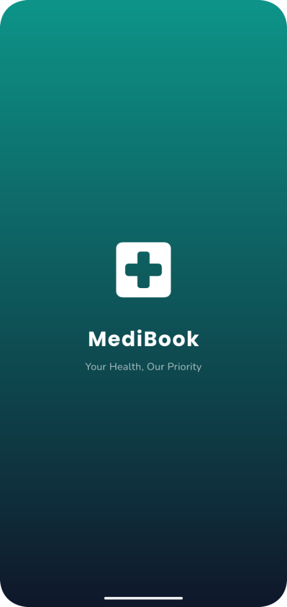
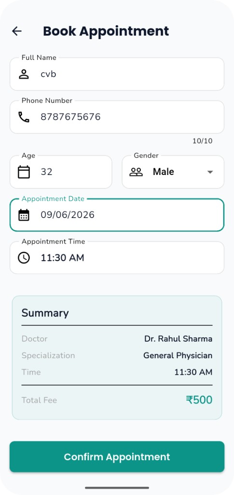
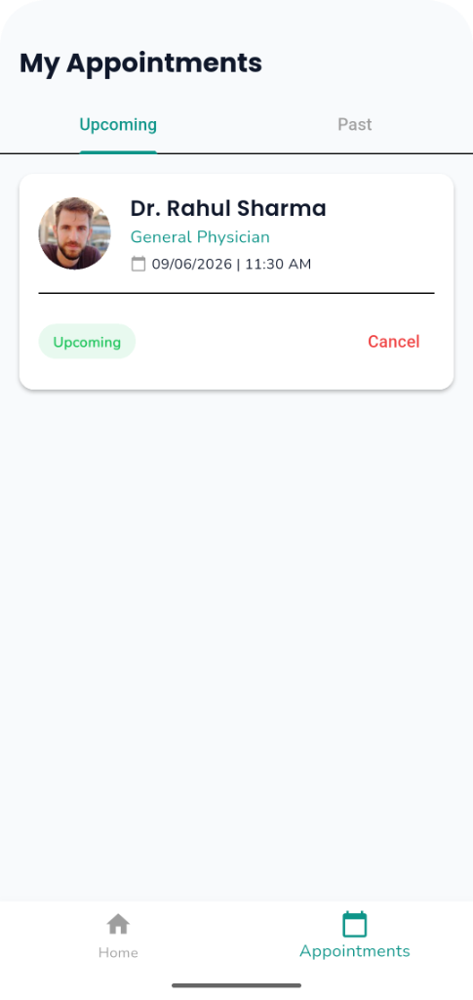

# MediBook - Clinic Appointment Booking App

MediBook is a complete, production-ready Clinic Appointment Booking mobile application built using Flutter.

## Project Description
MediBook allows users to browse top doctors, view their specializations, check their experience and ratings, select a time slot, and book an appointment. It features a complete UI flow starting from a Splash Screen, a Home Screen with categories and search functionality, a detailed Doctor Profile, an Appointment Booking form, and an Appointments history tab.

## Architecture & State Management
- **Architecture**: Clean Architecture with Feature-Based folder structure.
- **State Management**: Riverpod (`flutter_riverpod`) for managing doctors, filtering, selections, and appointments state.
- **Navigation**: `go_router` for robust declarative routing, including persistent `BottomNavigationBar` via `ShellRoute`.
- **Data Source**: Static mock JSON data. No backend is required. State resets upon app restart.

## Screenshots

<p float="left">
  
  
  
  
  
</p>

## Features Implemented
- Splash Screen with fade and scale animations.
- Real-time Doctor Search and Specialization Filtering via Category Chips.
- Doctor Detail screen with available slots selection.
- Appointment Booking Form with full validation.
- My Appointments Screen with Upcoming and Past tabs.
- Clean Architecture implementation separating domains, data, and presentation.
- Beautiful UI built using Google Fonts, custom themes, and `flutter_animate`.

## Setup Instructions

1. Ensure you have Flutter installed.
2. Clone this repository or open the `ClinicAppointment` directory.
3. Fetch dependencies:
   ```bash
   flutter pub get
   ```
4. Run the app on an emulator or physical device:
   ```bash
   flutter run
   ```

### Building APK
To build a release APK, run:
```bash
flutter build apk --release
```

## Assumptions Made
- The app uses static mock data. Appointments added via the form are stored in local memory using a Riverpod provider and will disappear when the app is fully closed or restarted.
- Using `flutter_animate` for UI transitions. 
- Using standard `CachedNetworkImage` with placeholder URLs (`randomuser.me`) for doctor avatars.
